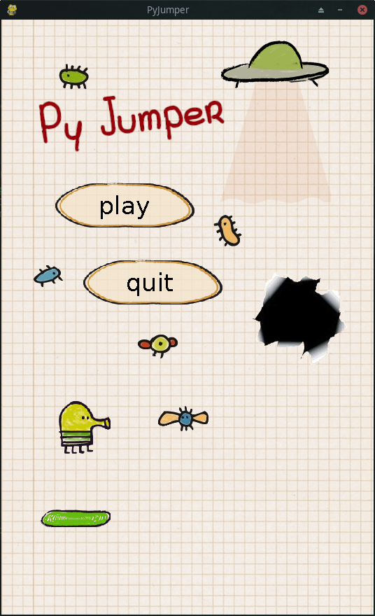

# Py Jumper

Doodle Jump like python game.



## Installation

Use the package manager [pip](https://pip.pypa.io/en/stable/) to install pygame.

```bash
pip install pygame
```

## Usage

```bash
python3 main.py
```

## License
[MIT](https://choosealicense.com/licenses/mit/)
